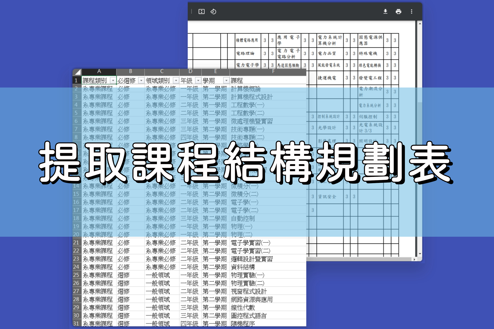

# 提取課程結構規劃表

## Overview

提取高雄科技大學電機工程系的課程結構規劃表，從 PDF 轉換特定內容到 CSV 格式，方便其他系統利用。

## Usage

- input(pdf)

    輸入檔案的資料夾，輸入檔案必須是 pdf。

- output(csv)

    輸出檔案的資料夾，將以副檔名 csv 格式輸出。

- main.py

    主要程式，修改 `FILE_NAME` 來指定要轉換的檔案。
